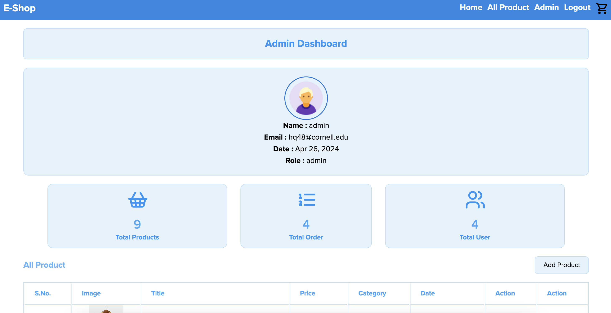

# E-Shop

This is a Full-Satck e-shop website that allows users to create an account, login, view/filter products, add/delete products, and checkout. The website can be accessed at the following URL:

https://teapot-two.vercel.app/





## Front End

The front end is built using **React and Redux**. The website is responsive and mobile friendly, styled using **Material-UI, Tailwind CSS**.

Product Figma wireframe can be found [here](https://www.figma.com/file/CI6a6qwYxDQ1NXVA1IHcND/eshop?type=design&node-id=0-1&mode=design&t=3uNDMWPrgdJWm318-0)

## Back End

The back end is built using **Firebase Database/Auth**. Firebase is used to store user data, product data, and order data. Firebase Authentication is used to authenticate users.

## Deployment

The website is hosted on **Vercel**. 

admin email:

```
hq48@cornell.edu
```

admin password:

```
password
```
## Run the project
After cloning the project, run the following commands in the root directory:

```
npm install
npm run dev
```